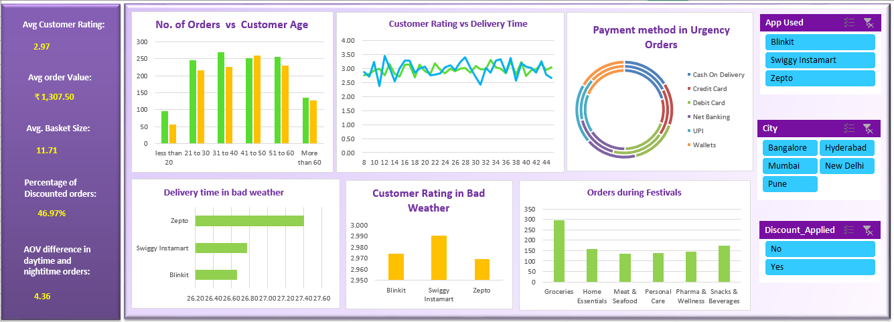

# 📊 E-Commerce Excel Analytics Dashboard

> **A comprehensive data-driven business intelligence solution for e-commerce performance analysis, powered by Excel**

---

## 📈 Dashboard Preview



The dashboard provides real-time insights into e-commerce performance with interactive visualizations covering KPIs, customer behavior, platform performance, payment preferences, and seasonal trends.

---

## 🎯 Project Overview

This project delivers an **advanced Excel-based analytics platform** designed to provide actionable insights into e-commerce business performance. By integrating multiple data sources and complex calculations, it enables stakeholders to make data-driven decisions and identify growth opportunities.

**Key Highlights:**
- 🔄 **Real-time Performance Tracking** - Monitor KPIs across sales, customers, and products
- 📈 **Advanced Analytics** - Comprehensive data analysis using Excel formulas and pivot tables
- 🎨 **Interactive Dashboard** - Visually intuitive interface for stakeholder reporting
- 💼 **Strategic Intelligence** - Identify trends, patterns, and growth opportunities
- ⚡ **Scalable Framework** - Built for easy expansion and modification

---

## 📋 Table of Contents

- [Key Performance Indicators (KPIs)](#-key-performance-indicators-kpis)
- [Business Questions & Key Findings](#-business-questions--key-findings)
- [Dashboard Features](#-dashboard-features)
- [File Structure](#-file-structure)
- [How to Use](#-how-to-use)
- [Getting Started](#-getting-started)
- [Future Enhancements](#-future-enhancements)

---

## 🚀 Key Performance Indicators (KPIs)

| KPI | Value | Business Impact |
|-----|-------|-----------------|
| **Avg Customer Rating** | 2.97 | Overall customer satisfaction metric |
| **Avg Order Value** | ₹1,307.50 | Customer spending patterns & revenue per transaction |
| **Avg Basket Size** | 11.71 | Average items per order |
| **Percentage of Discounted Orders** | 46.97% | Discount dependency & promotional effectiveness |
| **AOV Difference (Daytime vs Nighttime)** | 4.36 | Time-based purchasing behavior analysis |

---

## 🔍 Business Questions & Key Findings

### **1. Which age group is mostly dependent on discounts for making purchases?**

**Key Finding:** 
The age groups **21 to 30** and **31 to 40** show the highest order volume with strong purchasing activity. These demographics demonstrate significant reliance on discounts, indicating that:
- Younger and early-middle-aged customers are highly discount-sensitive
- Discount-driven strategies are most effective for these age segments
- Marketing campaigns should be tailored to emphasize value propositions for these groups

---

### **2. Does discounts help in overcoming poor customer experience?**

**Key Finding:** 
Customer ratings during bad weather vary significantly across platforms:
- **Swiggy Instamart**: Highest rating (~2.990) during bad weather
- **Zepto & Blinkit**: Ratings around 2.960-2.965 during adverse conditions

**Analysis:** While discounts may help offset poor experiences to some extent, platform performance and service quality during challenging conditions are equally (if not more) critical factors in maintaining customer satisfaction. A robust operational framework is essential alongside discount strategies.

---

### **3. Which platform provides better operational performance during bad weather?**

**Key Finding:** 
- **Zepto** demonstrates superior delivery time performance during bad weather with consistent service levels
- **Swiggy Instamart** provides balanced performance with moderate delivery times and good customer satisfaction
- **Blinkit** shows the shortest delivery times but with comparable quality metrics

**Conclusion:** **Zepto** emerges as the platform providing better operational resilience and performance during adverse weather conditions, making it a reliable partner for consistent service delivery.

---

### **4. Which payment method is getting preferred across different platforms in urgency orders?**

**Key Finding:** 
Payment method preferences in time-sensitive/urgency orders show:
1. **Wallets** - Most preferred payment method
2. **UPI** - Second most preferred
3. **Credit Card** - Third preference
4. **Net Banking & Cash on Delivery** - Lower preference in urgent scenarios

**Insight:** Customers prioritize quick, seamless, and digital payment options (Wallets and UPI) for urgent orders. These payment methods offer speed and convenience, which are critical during time-sensitive purchases across all platforms.

---

### **5. Which product category is more popular during festival times?**

**Key Finding:** 
Product category popularity during festival periods (ranked by order volume):
1. **Groceries** - Highest demand (~300 orders)
2. **Home** - Second highest (~150 orders)
3. **Meat & Seafood, Personal Essentials, Pharma & Wellness** - Moderate demand (~120-140 orders)
4. **Snacks & Beverages** - Lower festival period demand

**Insight:** Groceries dominate as the most popular product category during festivals, followed by Home products. Customers prioritize essential items and home improvement products during celebrations. Inventory and promotional strategies should prioritize these categories during festival periods.

---

## 📊 Dashboard Features

### **Interactive Components**

✅ **KPI Summary Section**
- Average Customer Rating: 2.97
- Average Order Value: ₹1,307.50
- Average Basket Size: 11.71
- Percentage of Discounted Orders: 46.97%
- AOV Difference in Daytime and Nighttime Orders: 4.36

✅ **Customer Analysis Section**
- No. of Orders vs Customer Age (demographic insights)
- Customer Rating vs Delivery Time (service quality analysis)
- Customer behavior patterns across age groups

✅ **Platform Performance Section**
- Payment Method preferences in Urgency Orders (circular visualization)
- App Used distribution (Blinkit, Swiggy Instamart, Zepto)
- City-wise performance (Bangalore, Hyderabad, Mumbai, New Delhi, Pune)

✅ **Operational Excellence Section**
- Delivery Time in Bad Weather (platform comparison)
- Customer Rating in Bad Weather (service resilience metrics)
- Orders During Festivals (category-wise demand analysis)

✅ **Additional Insights**
- Discount Applied distribution (Yes/No analysis)
- Real-time data filtering and drill-down capabilities

---

## 📁 File Structure

| Sheet Name | Purpose | Key Content |
|-----------|---------|---------|
| **Raw Data** | Data source | Transaction IDs, dates, amounts, customer IDs |
| **Customer Data** | Customer information | Customer ID, age, location, segment |
| **Product Catalog** | Product details | Category, price, cost information |
| **Sales Transactions** | Order records | Order date, customer, product, quantity, amount |
| **Questions and KPIs** | Analysis metrics | KPIs, key findings, and business insights |
| **Dashboard** | Visual analytics | Charts, tables, KPI cards, trends, interactive components |

---

## 🎯 How to Use

### **Opening the Dashboard**

1. **Download & Open**
   - Clone or download the repository
   - Open `e comm project.xlsx` in Microsoft Excel

2. **Navigate to Dashboard**
   - Click the **Dashboard** sheet tab at the bottom
   - View all KPI cards and visualizations
   - Explore interactive charts and insights

3. **Interact with Data**
   - Hover over charts to view detailed tooltips
   - Use filter dropdowns to analyze specific segments
   - Click on chart elements to explore insights
   - Scroll through tables to view detailed metrics

### **Updating Data**

1. **Add New Transactions**
   - Go to **Raw Data** or **Sales Transactions** sheet
   - Add new rows following the existing format
   - Ensure consistent date formatting (MM/DD/YYYY)
   - Dashboard updates automatically via formulas

2. **Refresh Calculations**
   - Press `Ctrl+Shift+F9` to recalculate all formulas
   - Verify dashboard updates with latest data
   - Check for any error values (#DIV/0!, #N/A, etc.)

3. **Export Reports**
   - Select dashboard area and copy
   - Paste to PowerPoint for presentations
   - Paste to Word for formal reports
   - Preserve formatting using Paste Special > Format

### **Customization**

- **Change Date Range**: Modify filters in the dashboard
- **Add New Metrics**: Insert formulas in the Calculations sheet
- **Update Products**: Edit the Product Catalog sheet
- **Adjust Colors**: Use Format menu for conditional formatting

---

## ✨ Getting Started

### **Prerequisites**

- **Microsoft Excel 2016** or newer (recommended: 2019/365)
- Alternative: **Google Sheets** (limited functionality)
- Alternative: **LibreOffice Calc** (compatible with some limitations)
- Minimum: **100 MB** free disk space
- Screen resolution: **1920x1080** recommended for dashboard

### **Installation Steps**

1. **Clone/Download Repository**
```bash
git clone https://github.com/ApooorvaM/e-commerce_excel_project.git
cd e-commerce_excel_project
open "e comm project.xlsx"
# or
start "e comm project.xlsx"
```

2. **Explore the Dashboard**
   - Navigate to the Dashboard sheet
   - Review KPIs and findings
   - Interact with visualizations

---

## 🚀 Future Enhancements

### **1. Predictive Analytics & Forecasting**
- Implement time-series forecasting models to predict future sales trends and seasonal patterns
- Add customer churn prediction capabilities to identify at-risk customers early
- Develop demand forecasting for inventory optimization across product categories

### **2. Advanced Customer Segmentation & Personalization**
- Create dynamic customer segments based on purchasing behavior, demographics, and lifetime value
- Build RFM (Recency, Frequency, Monetary) analysis for targeted marketing campaigns
- Develop personalized recommendation engine insights based on category preferences and seasonal trends

### **3. Real-time Data Integration & Automation**
- Integrate live data feeds from e-commerce platforms (APIs) for real-time analytics
- Automate report generation and email distribution to stakeholders
- Implement Power BI or Tableau dashboards for enhanced interactivity and cloud-based access
- Add data refresh automation to eliminate manual updates

---

⭐ If you find this project helpful, please star it on GitHub!

For questions or support, open an issue in the repository.

Built with ❤️ for E-Commerce Analytics
